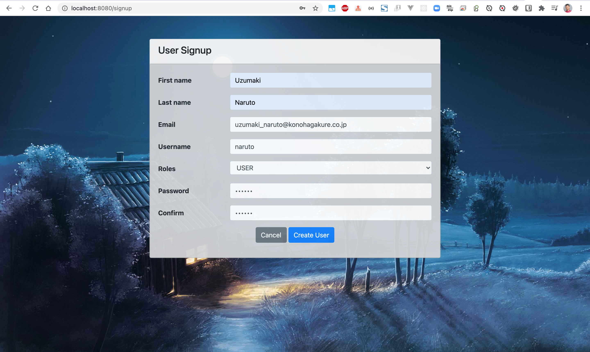
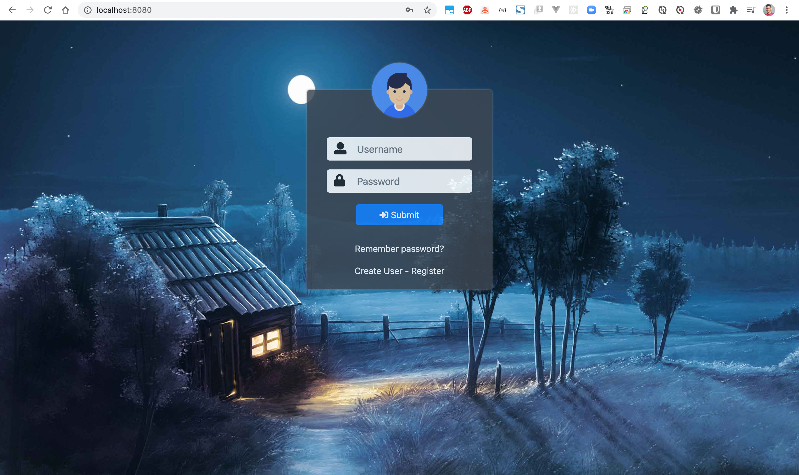
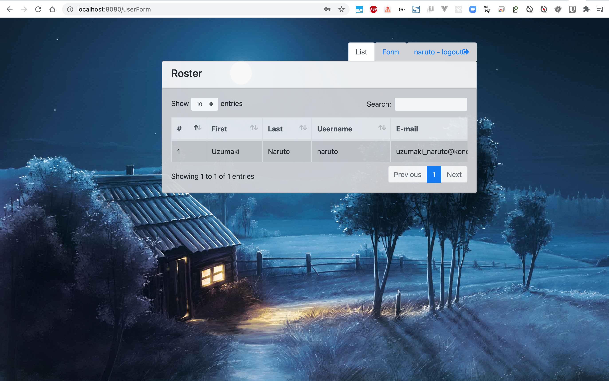
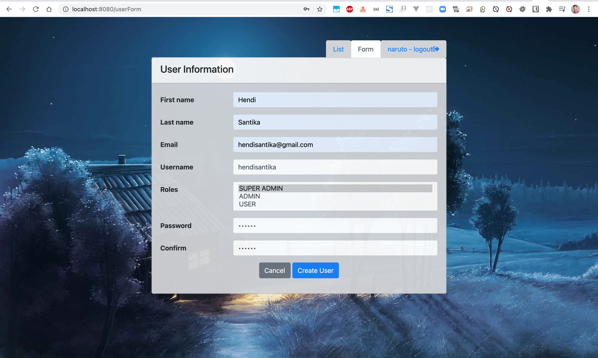

# user-management

### Things todo list:

1. Clone this repository: `git clone https://github.com/hendisantika/user-management.git`
2. Navigate to the folder: `cd user-management`
3. Run the application: `mvn clean spring-boot:run`
4. Open your favorite browser: http://localhost:8080

### Image Screen shots

Registration Page

Login Page

List Users Page

User Information Page

